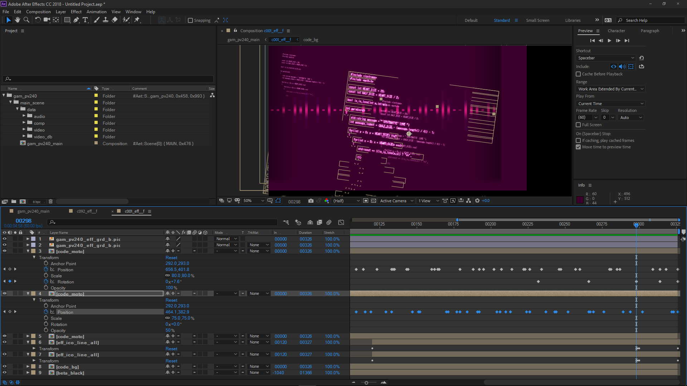

# Aet Plugin
An Adobe After Effects plugin for importing and exporting AetSet files (`aet_*.bin` / `aet_*.aec`) used by the Project DIVA series of games as well as various other SEGA titles such as Virtua Fighter 5, After Burner Climax and more (often with slight changes in format making them incompatible).

Aet files comprise of simple 2D layered sprite animations that are sometimes also used for defining in-game HUD / menu UI layouts and touch-screen regions.
As evidence shows, After Effects is the program originally used by the developers themselves to create these assets which this plugin tries to replicate in functionality.




# Installation
The minimum required version for this plugin is >= `AE v10.0` on Windows (After Effects CS5, released 2010). 
All future versions of AE should work correctly thanks to Adobe's strong commitment to backwards compatibility.

You can download the latest compiled version from the [releases page](https://github.com/samyuu/AetPlugin/releases/).
After Effects plugins come in the form of `.aex` files which are essentially Windows DLLs so to install it simply extract and copy the `AetPlugin.aex` file somewhere into your AE Plug-ins folder of whatever version you're using.

(Example: `C:/Program Files/Adobe/Adobe After Effects CC 2018/Support Files/Plug-ins/AetPlugin/AetPlugin.aex`)


# How to Import
To import an aet file first copy the relevant files into a *separate* folder in the format:
```
import_dir/aet_db.bin
import_dir/aet_{some_file}.bin
import_dir/spr_db.bin
import_dir/spr_{some_file}.farc
```
or in case of the more modern games: (Projet DIVA F-2nd, X, XHD)
```
import_dir/aet_{some_file}.farc
import_dir/spr_{some_file}.farc
```
then just drag and drop the `aet_{some_file}.bin/.farc` on top of the After Effects window *or* right click and `Import > File...` with `Project DIVA AetSet (*.bin;*.aec;*.farc)` selected.

The plugin will automatically extract all sprites as PNG files and write them into the input directory which might take a moment.
These image files are then linked via their file path into your AE project and shouldn't be moved (unless you want to manually fix up file paths).

# How to Export
To export an aet file click on `File > Export > Export Project DIVA AetSet...`, choose your desired settings + file location and confirm by clicking the `Save` button.

When exporting only the older `.bin` aet (and `*_db.bin`) format is natively supported. However these files can technically manually be converted to the newer format afterwards [if you put in the effort](https://github.com/blueskythlikesclouds/MikuMikuLibrary/).


## Problems (Unfixable?)
There's a general degradation of image quality due to lossy GPU texture compression as is to be expected, though definitely not the end of the world.

More importantly however, keyframe interpolation is basically broken as a byproduct of trying to minimize data loss that comes from importing and a fundamental limitation in the file format itself.
All interpolation options inside AE are therefore ignored and duplicate "balancing" keyframes surrounding all other regular keyframes may have to be inserted *manually* for newly created animations. 

As far as I can tell there is no real way to fix this while still supporting both *importing* and *exporting* and also not loosing *even more* data.
Broadly speaking, **the AE preview cannot be trusted** and this is the single biggest problem with this plugin and what makes me very hesitant in recommending anyone use this for any serious kind of work.


## Why you *shouldn't* use this (we're in for the memes)
After Effects is slow. *Very* slow. **Comedically slow**. If you are an unfortunate soul stumbling upon this for the first time... *no*. It is not in fact *your computer*. After Effects *really is* uncapable of smoothly animating *even a single image* moving around *in real time* without pre-rendering the whole animation in memory and spamming your disk cache folder with *gigabytes* worth of raw frames in the process. No matter your fancy new 69-Core quantum-accelerated CPU. "This is fine" - Adobe, apparently.

Now usually, this can be a trade-off worth making in exchange for the extensive and powerful feature set provided by this all so \<wonderful\> program, with its large library of useful plugins, scripting system, professionals with decades worth of experience being able to create amazing works of art... 
**however**, here this hardly applies.

The only thing supported by aet files are simple static image / flipbook sequence layers with up to one (1) other image alpha mask on top.
Compositions *can not* be used as alpha masks nor can they be clipped any other way (all layers are treated as "Collapsed" meaning they extend outwards).

Effect layers *do not exist*. Text *does not exist*. Any other form of cool shape animation also *does not work*.
The only properties that can be animated are `Ancho Point`, `Position`, `Scale`, `Rotation`, `Opacity` and to some extend the rest of the 3D layer transforms.
If you want a black background for example, you'll have to add a 1x1 pixel black image and stretch it yourself. If you want to smoothly change it's color for example, then tough luck!

Anything and all that makes Affect Effects powerful simply is not supported.
Huge respect to all of the artists who were able to create elaborate and very impressive looking animations despite all the limitations, for these games.
And you know what they say, "Limitations leads to creativity" and the meme potential with this and enough determination is truly incredibly.


# License
This program is licensed under the [MIT License](LICENSE) and embeds a copy of the source code for the [zlib](https://www.zlib.net/), [DirectXTex](https://github.com/Microsoft/DirectXTex) and [stb_image](https://github.com/nothings/stb/) / [stb_image_write](https://github.com/nothings/stb/) libraries.